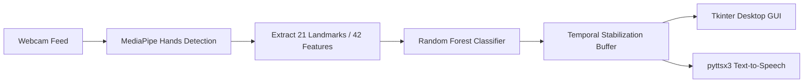
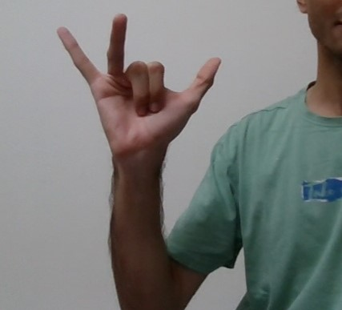

# Real-Time Sign Language Recognition

An intelligent, real-time computer vision and machine learning application designed to bridge the communication gap between hearing/speech-impaired individuals and the broader community. The system captures American Sign Language (ASL) hand gestures through a standard webcam, classifies them into text, forms words and sentences, and vocalizes them using speech synthesis.

---

##  Key Features

- **Real-Time Hand Landmark Tracking**: Utilizes Google MediaPipe Hands to detect 21 hand landmarks (42 normalized $x, y$ coordinates) with minimal latency.
- **High-Accuracy Classification**: Powered by an optimized Random Forest classifier trained on 38 gesture classes.
- **38 Gesture Classes**:
  - **Alphabets**: A – Z (26 classes)
  - **Numbers**: 0 – 9 (10 classes)
  - **Special Control Gestures**: Space (` `) and Full Stop (`.`)
- **Flicker-Free Stabilization & Debounce**: Implements a sliding temporal window buffer and registration delay to prevent false positives and jittery predictions.
- **Word & Sentence Assembly**: Dynamically constructs characters into words upon detecting spaces, and sentences upon detecting periods.
- **Text-to-Speech (TTS) Synthesis**: Integrated with `pyttsx3` running in dedicated worker threads for non-blocking audible speech.
- **Modern Desktop GUI**: Built with Tkinter, featuring a live annotated camera feed, real-time character/word/sentence displays, pause/play control, and reset capabilities.
- **End-to-End Training Pipeline**: Includes scripts to collect custom training samples, extract landmark datasets, and train new machine learning models.

---

##  Project Architecture & Workflow



### File Structure

```text
├── ReadmeAssets/           # Visual references for gestures and diagrams
│   ├── Fullstop.jpg
│   ├── J.jpg
│   ├── Space.jpg
│   ├── The-26-letters-and-10-digits-of-American-Sign-Language-ASL.png
│   └── Z.jpg
├── collectImgs.py          # Script to collect custom dataset images via webcam
├── createDataset.py        # Extracts hand landmarks from collected images into data.pickle
├── main.py                 # Main real-time application with Tkinter GUI & TTS
├── model.p                 # Serialized pre-trained Random Forest model
├── requirements.txt        # Python dependency manifest
└── trainClassifier.py      # Trains classifier on data.pickle and outputs model.p
```

---

## Gesture Reference Guide

### ASL Alphabets & Digits


### Special Action Signs
| Space Sign | Full Stop Sign | Sign for J | Sign for Z |
| :---: | :---: | :---: | :---: |
|  |  |  |  |

---

## ⚙️ Installation & Setup

### 1. Prerequisites
- Python 3.9, 3.10, or 3.11
- A working webcam / integrated camera
- Working audio output (speakers / headphones)

### 2. Clone the Repository
```bash
git clone https://github.com/policepatelvijayprakashreddy-sys/real-time-sign-language-recognition.git
cd real-time-sign-language-recognition
```

### 3. Install Dependencies
```bash
pip install -r requirements.txt
```

#### Included Libraries
- `opencv-python`: Camera capture and frame manipulation
- `mediapipe`: Robust real-time hand pose and landmark estimation
- `scikit-learn`: Random Forest model inference and evaluation
- `numpy`: Numerical processing and landmark vector manipulation
- `pyttsx3`: Offline text-to-speech synthesis
- `pillow`: Image processing bridge for Tkinter

---

## Running the Application

A pre-trained model (`model.p`) is already provided in the repository, allowing immediate execution without prior data collection.

Launch the GUI application:
```bash
python main.py
```

### GUI Controls & Operation
- **Webcam Feed**: Displays real-time hand landmark skeletons and the currently identified character.
- **Current Alphabet**: Displays the real-time stabilized character.
- **Current Word**: Accumulates characters into a word. Triggering the **Space** gesture automatically speaks the word and moves it to the sentence.
- **Current Sentence**: Accumulates full sentences. Triggering the **Full Stop** (`.`) gesture completes the sentence.
- **Buttons**:
  - `Reset Sentence`: Clears current word and sentence buffers.
  - `Pause / Play`: Freezes or resumes the camera feed and recognition.
  - `Speak Sentence`: Audibly reads out the current full sentence.

---

## Retraining / Custom Dataset Pipeline

To expand or retrain the model with your own gestures:

### Step 1: Collect Custom Image Samples
```bash
python collectImgs.py
```
- By default, captures 100 images per class for 38 classes (0 to 37) into a `./data` directory.
- Press **Q** when ready to start recording images for each class.

### Step 2: Extract Landmark Features
```bash
python createDataset.py
```
- Iterates over `./data/`, processes each image through MediaPipe Hands, extracts the 42 coordinate features, and saves them into `data.pickle`.

### Step 3: Train the Classifier
```bash
python trainClassifier.py
```
- Loads `data.pickle`, splits data into train/test sets (80/20), trains a `RandomForestClassifier`, prints accuracy metrics, and exports the new `model.p`.

---

## Troubleshooting & Notes

- **Webcam Access**: Ensure no other application (Zoom, Teams, Browser) is using your webcam before running `main.py` or `collectImgs.py`.
- **Lighting & Hand Visibility**: For optimal accuracy, position your hand within the frame in good lighting conditions with a clear contrast against the background.
- **TensorFlow / OneDNN warnings**: Informational messages regarding OneDNN or feedback tensors from MediaPipe can be safely ignored.
